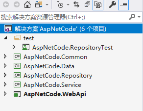
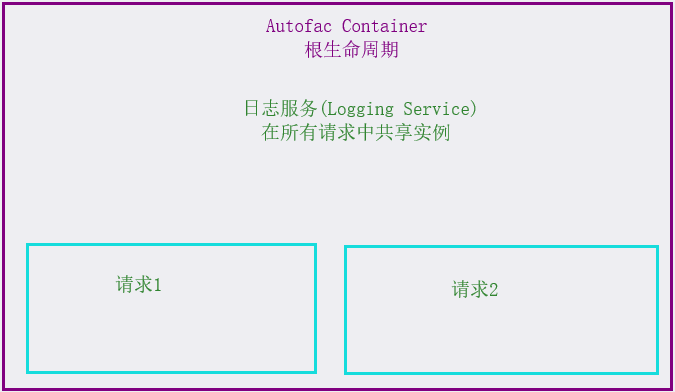

### 项目简介

#### 概述

本项目是一套基于三层架构设计的架构模型，适用于中大型项目的快速开发。

接下来通过一个简单的实例来快速体验一下：

``` C#
public class UserService : IUserService
{
	private IMapper _mapper;
	private IRepository<UserEntity> _userRepository;

	public UserService(IMapper mapper, IRepository<UserEntity> userRepository)
	{
		this._mapper = mapper;
		this._userRepository = userRepository;
	}

	public IEnumerable<UserDto> UserList()
	{
		IEnumerable<UserEntity> userList = _userRepository.GetAll().ToList();

		return _mapper.Map<IEnumerable<UserDto>>(userList);
	}
}
```

上述示例是`Service`方法，在项目设计中,服务层主要项目项目中的业务逻辑处理。

本项目中采用以下技术搭建：

* 依赖注入(DI)：采用Autofac作为依赖注入容器，用于解析依赖关系
* 仓储(Repository)：为每个实体创建一个默认的仓储(例如上述示例中的`IRepository<UserEntity>`)，在仓储接口中定义了基础的CRUD方法，同时也可以根据自身需要进行扩展
* 工作单元(UnitOfWork)：针对不同的仓储类进行统一的数据上下文处理
* 数据验证(Validation):基于标准的数据注释和自定义验证规则验证输入的所有属性
* 审计日志记录(AuditLog):自动保存为每个请求用户信息，IP地址，方法参数，调用时间等信息
* 异常处理(Exception)：在默认情况下，当应用程序发生异常的时候，会向客户端展示请求异常，并自动记录异常信息。
* 日志记录(Logging):默认使用log4net记录日志信息
* 自动映射(AutoMapper)：通过AutoMapper库来执行映射，可以会根据命名约定轻松地将属性将一个对象映射到另一个对象

#### 项目框架

项目框架如下：



* 通用层(Common):封装通用方法
* 数据层(Data)：用于存放实体及数据库上下文类
* 仓储层(Repository):用于封装基础的数据CRUD操作
* 服务层(Service):处理业务逻辑，提供与界面的接口
* WebApi
* Test:单元测试类


### 仓储及工作单元模式

#### 什么是仓储和工作单元？

随着ORM的出现，让数据访问变得简单直接，这将会导致数据访问逻辑可能散落在整个应用程序中。例如，在业务逻辑层中，会频繁地实例化DbContext。

``` C#
public class CourseService
{
    public List<CourseEntity> CourseList()
	{
		using (EFContext db=new EFContext())
		{
			return db.Courses.Include(m=>m.Teacher).ToList();
		}
	}
    
    public void CourseAddSave(CourseEntity saveEntity)
	{
		using (EFContext db=new EFContext())
		{
			db.Courses.Add(saveEntity);
			db.SaveChanges();
		}
	}
}
```

使用了仓储模式和工作单元模式使通过ORM进行数据访问操作变得更加干净整洁，将所有的数据访问放在同一个位置，这样可以提升项目的可维护性和可测试能力。

#### 仓储模式

在仓储模式中，将所有的包含数据访问逻辑的代码独立出来，同时定义一个接口对数据访问进行约定。

首先定义仓储的访问接口：

``` C#
public interface IRepository<TEntity> where TEntity : Entity
{

	/// <summary>
	/// 获取所有数据
	/// </summary>
	/// <returns></returns>
	IQueryable<TEntity> GetAll();

	/// <summary>
	/// 获取所有数据
	/// </summary>
	/// <param name="filter">条件筛选</param>
	/// <returns></returns>
	IQueryable<TEntity> GetAll(Expression<Func<TEntity, bool>> filter);

	/// <summary>
	/// 显式获取数据
	/// </summary>
	/// <param name="propertySelectors">加载的导航属性</param>
	/// <returns></returns>
	IQueryable<TEntity> GetAllIncluding(params Expression<Func<TEntity, object>>[] propertySelectors);

	/// <summary>
	/// 显式获取数据
	/// </summary>
	/// <param name="filter">条件筛选</param>
	/// <param name="propertySelectors">加载的导航属性</param>
	/// <returns></returns>
	IQueryable<TEntity> GetAllIncluding(Expression<Func<TEntity, bool>> filter, params Expression<Func<TEntity, object>>[] propertySelectors);


	/// <summary>
	/// 根据Id获取
	/// </summary>
	/// <param name="id">实体Id</param>
	/// <returns></returns>
	TEntity GetById(int id);

	/// <summary>
	/// 添加
	/// </summary>
	/// <param name="saveEntity">要添加的实体类</param>
	void Insert(TEntity saveEntity);

	/// <summary>
	/// 编辑
	/// </summary>
	/// <param name="saveEntity">编辑后的实体类</param>
	void Update(TEntity saveEntity);

	/// <summary>
	/// 根据Id删除
	/// </summary>
	/// <param name="id">实体Id</param>
	void Delete(int id);

	/// <summary>
	/// 根据实体删除
	/// </summary>
	/// <param name="saveEntity">要删除的实体类</param>
	void Delete(TEntity saveEntity);

	/// <summary>
	/// 获取数据记录总条数
	/// </summary>
	/// <returns></returns>
	int Count();


	/// <summary>
	/// 获取数据记录总条数
	/// </summary>
	/// <param name="filter">条件筛选</param>
	/// <returns></returns>
	int Count(Expression<Func<TEntity, bool>> filter);

	/// <summary>
	/// 获取记录总条数
	/// </summary>
	/// <param name="filter">条件筛选</param>
	/// <param name="propertySelectors">加载的导航属性</param>
	/// <returns></returns>
	int Count(Expression<Func<TEntity, bool>> filter, params Expression<Func<TEntity, object>>[] propertySelectors);
}
```

接下来完成对接口数据操作的实现：

``` C#
public class Repository<TEntity> : IRepository<TEntity> where TEntity : Entity
{
	private dbContext=new EFContex();
	private dbSet=dbContext.Set<Tentity>();

	/// <summary>
	/// 获取所有数据
	/// </summary>
	/// <returns></returns>
	public IQueryable<TEntity> GetAll()
	{
		return dbSet;
	}

	/// <summary>
	/// 获取所有数据
	/// </summary>
	/// <param name="filter">条件筛选</param>
	/// <returns></returns>
	public IQueryable<TEntity> GetAll(Expression<Func<TEntity, bool>> filter)
	{
		return GetAll().Where(filter);
	}

	/// <summary>
	/// 显式获取数据
	/// </summary>
	/// <param name="propertySelectors">加载的导航属性</param>
	/// <returns></returns>
	public IQueryable<TEntity> GetAllIncluding(params Expression<Func<TEntity, object>>[] propertySelectors)
	{
		if (propertySelectors.Length == 0)
		{
			return GetAll();
		}

		var query = GetAll();
		foreach (var propertySelector in propertySelectors)
		{
			query = query.Include(propertySelector);
		}

		return query;
	}

	/// <summary>
	/// 显式获取数据
	/// </summary>
	/// <param name="filter">条件筛选</param>
	/// <param name="propertySelectors">加载的导航属性</param>
	/// <returns></returns>
	public IQueryable<TEntity> GetAllIncluding(Expression<Func<TEntity, bool>> filter,
		params Expression<Func<TEntity, object>>[] propertySelectors)
	{
		var query = GetAll(filter);
		if (propertySelectors.Length == 0)
		{
			return query;
		}

		foreach (var propertySelector in propertySelectors)
		{
			query = query.Include(propertySelector);
		}

		return query;
	}

	/// <summary>
	/// 根据Id获取
	/// </summary>
	/// <param name="id">实体Id</param>
	/// <returns></returns>
	public TEntity GetById(int id)
	{
		return dbSet.Find(id);
	}

	/// <summary>
	/// 添加
	/// </summary>
	/// <param name="saveEntity">要添加的实体类</param>
	public void Insert(TEntity saveEntity)
	{

		dbSet.Add(saveEntity);

	}

	/// <summary>
	/// 编辑
	/// </summary>
	/// <param name="saveEntity">编辑后的实体类</param>
	public void Update(TEntity saveEntity)
	{
		context.Entry(saveEntity).State = EntityState.Modified;
	}

	/// <summary>
	/// 获取总数
	/// </summary>
	/// <returns></returns>
	public int Count()
	{
		return dbSet.Count();
	}

	/// <summary>
	/// 获取数据记录总条数
	/// </summary>
	/// <param name="filter">条件筛选</param>
	/// <returns></returns>
	public int Count(Expression<Func<TEntity, bool>> filter)
	{
		return GetAll(filter).Count();
	}

	/// <summary>
	/// 获取记录总条数
	/// </summary>
	/// <param name="filter">条件筛选</param>
	/// <param name="propertySelectors">加载的导航属性</param>
	/// <returns></returns>
	public int Count(Expression<Func<TEntity, bool>> filter,
		params Expression<Func<TEntity, object>>[] propertySelectors)
	{
		return GetAllIncluding(filter, propertySelectors).Count();
	}

	/// <summary>
	/// 根据Id删除
	/// </summary>
	/// <param name="id">实体Id</param>
	public void Delete(int id)
	{
		TEntity entity = dbSet.Find(id);

		Delete(entity);
	}

	/// <summary>
	/// 根据实体删除
	/// </summary>
	/// <param name="saveEntity">要删除的实体类</param>
	public void Delete(TEntity saveEntity)
	{
		dbSet.Remove(saveEntity);
	}

}
```

#### 工作单元模式

当在一个操作中需要处理多个Repository时，需要为每个表创建一个Repository类，这样会造成大量的重复工作。除此之外，当创建多个Respository时，每个Repository都包含一个单独的数据库上下文类，在同时操作多个数据库上下文的时候，可能会造成数据并发及脏读。为了解决这个问题，可以在同一类中创建一个实例，然后在Repository被实例化的时候将数据上下文作为参数传递过去，这个类被命名为UnitOfWork（工作单元）,工作单元的职责就是创建数据库上下文实例并移交到所有的Repository中。

使用了工作单元后，Repository中的数据库上下文将会从外部得到。

#### 通用仓储和工作单元


### 依赖注入

#### 什么是依赖注入？

依赖注入是一种软件设计模式的一个或多个依赖项注入(或服务)，或通过引用传递，为依赖对象(或客户)和客户端状态的一部分。模式之间建立一个客户的依赖关系的行为，它允许程序设计是松散耦合的，依赖倒置和单一职责原则。

如果不使用依赖注入技术，很难进行依赖管理、模块化开发和应用程序模块化。

##### 传统开发模式中存在的问题

在一个应用程序中，类之间是相互依赖的。在一个应用服务中，使用仓储(Repository)类将实体插入到数据库。在这种情况下，应用程序服务类依赖于仓储类。

``` C#
public class UserService
{
     private IUserRepository _userRepository;
     //private UserRepository=new UserRepository();
    
     public UserService()
     {
         _userRepository = new UserRepository();            
     }
    
      public void CreateUser(UserEntity userEntity)
      {
          _userRepository.Insert(userEntity);
      }
}
```

在上述代码中，`UserService`使用`UserRepository`插入`UserEntity`到数据库。在上述代码中，存在以下问题：

* `UserService`通过`IUserRepository`调用`CreateUser`方法，所以这个方法依赖于`IUserRepository`，代替了`UserRepository`的具体类。但是 `UserService`(构造方法)仍然依赖于`UserRepository`。在依赖倒置原则中，程序要依赖于抽象，而不应该依赖于实现
* `UserRepository`是由`UserService`创建的，`UserService`就成为了依赖`IUserRepository`接口的具体实现。此种方式下，接口与实现的分离将变得毫无意义。硬依赖（Hard-Dependency）让代码紧密耦合且可重用性降低。
* 假如需要改变`UserRepository`的创建方式，例如像让它创建为单例(单一共享实例而不是为每个使用创建一个对象)。或者是要创建多个类实现`IUserRepository`并根据条件创建对象，这时就需要修改所有依赖于`IUserRepository`的类
* 在有了强依赖的情况下，很难进行单元测试。

##### 解决方案

将上述代码进行重写：

``` C#
public class UserService
{
     private IUserRepository _userRepository;
    
     public UserService(IUserRepository userRepository)
     {
         _userRepository = userRepository;            
     }
    
      public void CreateUser(UserEntity userEntity)
      {
          _userRepository.Insert(userEntity);
      }
}
```

这被称为构造函数注入，现在，在UserService中不知道哪些类实现`IUserRepository`以及如何创建它。当需要使用`UserService`时，首先创建一个`IUserRepository`，并将其作为参数传递给其构造函数。

``` C#
UserRepository userRepository=new UserRepository();
UserService userService=new UserService(userRepository);
userService.CreateUser(userEntity);
```

使用了构造函数注入，就可以使一个类独立创建依赖对象，但是以上方式也存在一些问题：

* 对于`UserService`的创建变得困难，假如一个Service中有四个依赖，就必须创建四个依赖对象，并将他们传递到构造函数`UserService`
* 从属类可能有其他依赖项（例如`UserRepository`可能有依赖关系），所以必须创建`UserService`所有的依赖项，所有依赖项的依赖关系。这时，创建一个对象就变得过于复杂了。

#### 依赖注入框架

有许多依赖注入的框架，都可以自动的解析依赖关系。依赖框架可以创建所有的依赖项(递归地依赖和依赖关系)。所以只需要根据注入模式写上类构造函数和属性，其他的内容都可以由依赖注入框架(DI)处理。在良好的应用程序中，类甚至可以独立于依赖框架，整个应用程序中只会有几行代码或类，就可以解析所有的依赖关系了。

Autofac是.NET开发平台中的一个轻量级DI框架，支持与Mvc、WebApi等框架集成。同时也有详尽的中文文档。在.NET开发平台下，还有很多其他的依赖注入框架如Unity，Ninject，StructureMap，Castle Windsor等。

在使用一个依赖框架时，首先需要注册接口/抽象类到依赖注入框架中，然后就可以解析这个对象。在Autofac中，应该这样实现：

``` C#
ContainerBuilder builder=new ContainerBuilder();

builder.Register<UserRepository>().As<IUserRepository>().InstanceLifetimeScope();
builder.Regiser<UnitOfWork>().As<IUnitOfWork>().InstanceLifetimeScope();
builder.Regiser<UserService>().As<IUserService>().InstanceLifetimeScope();

var container=builder.Build();

using(var scope=container.BeginLifetimeScope())
{
    var userService=scope.Resolve<IUserService>();
    userService.Insert(userEntity);
}
```

在上述代码中，首先创建了`ContainerBuilder`然后注册了`UserRepository`、`UnitOfWork`和UserService和它们的接口。接下来从依赖注入容器中解析已经实例化的I`UserServices`对象。依赖注入容器就会创建UserService对象及其依赖项并返回。在实际项目中，只需要在程序启动时的某个位置创建一次就会自动将所有依赖关系进行解析。

##### 生命周期及作用域

生命周期是指服务实例在应用中存在的时长（从开始实例化到最后释放结束）。例如，如果实例化了一个实现了`IDisposiable`的对象并且之后调用了它的`Dispose()`方法，对象的生命周期就是从实例化一直到到释放。

作用域是指在应用中能共享给其他组件的并被消费的范围。例如，在应用中有个全局的静态单例，那么这个全局对象实例的作用域将会是整个应用。另一方面，如果在一个for循环中创建了引用了全局单例的一个局部变量，那么这个局部变量就拥有比全局变量小很多的作用域。

在Autofac中，将生命周期与作用域这两个概念组合在了一起. 实际上, 生命周期作用域等同于应用中的一个工作单元. 一个工作单元将会在开始时启动生命周期作用域, 然后需要该工作单元的服务被从生命周期作用域中解析出. 当解析服务时, Autofac将会追踪被解析的可释放/可销毁 (`IDisposable`) 组件. 在工作单元最后, 释放了相关的生命周期作用域然后Autofac将会自动清理/释放那些被解析的服务。

**生命周期控制作用域的两个要素是共享和释放**：

* **生命周期作用域是可嵌套的并且它们控制了组件如何共享。**例如，在Autofac中将一个服务注册为单例，那么它将会在在根生命周期解析，因为每个独立的工作单元会需要它们各自的服务实例。在Autofac中，可以在注册时设置其实例作用域并决定如何将组件共享。
* **生命周期作用域追踪可释放对象并且当生命周期作用域被释放同时释放它们.** 例如, 在Aufofac中注册了一个实现 `IDisposable` 的组件并且从生命周期中解析了它, 生命周期作用域将会保持住它并且释放它, 这样的话服务的调用者就不必关心其内在具体实现。

要在Autofac中合理有效地去使用资源，应注意：

* 解析服务时，应该从生命周期作用域中解析，而不是从根容器中解析。如果从一个容器中解析了太多组件，就会造成内存泄漏
* 根生命周期会在它存在的时间(通常是应用的生命周期)内保持可释放的组件，通常需要在生命周期中去解析
* 如果在Autofac中注册单例，将会自动地将其安放在一个合适的追踪作用域之内。

在Autofac中，假设有以下场景：

1. 有一个全局的单例日志服务
2. 两个请求同时进入到Web中
3. 每个请求是一个逻辑上的"工作单元"，并且每个请求都需要他们自己的服务实例
4. 每个服务实例都需要使用日志服务来记录信息



当请求结束时，请求的生命周期将会结束，同时，每个请求的服务实例都会得到释放，而日志服务将会作为一个单例，将会继续保持在根生命周期内部以备后续请求共享。

##### Autofac中的实例作用域

实例的作用域决定了对于相同的服务器解析出的实例如何在请求之间共享

当一个请求出现并且需要某种服务，Autofac可以返回一个单一实例(单一作用域),也可以返回一个新的实例(每个依赖的作用域),获取返回一个在某种上下文中的单一实例，例如一个线程或者一个Http请求(每个生命周期作用域)

**每个依赖一个实例(Instance Per Dependency)**

对于一个服务，每次请求都会返回一个唯一的实例，这是默认的方式

``` C#
ContainerBuilder builder=new ContainerBuilder();

builder.Register<UserService>().As<IUserService>().InstancePerDependency();
```

当开始解析的时候，在同一个生命周期中，每个依赖都会得到一个新的实例。

**单一实例(Single Instance)**

实例单一实例的方式注册组件，在跟容器和所有的嵌套作用域内所有请求都会返回同一个实例

``` C#
ContainerBuilder builder=new ContainerBuilder();

builder.Register<UserService>().As<IUserService>().InstancePerDependency();
```

**每个生命周期作用域一个实例(Instance Per Liffetime Scope)**

该作用域将会应用于嵌套生命周期，每个生命周期的作用域的组件在其生命周期作用域内部将会返回一个唯一的示例。

``` C#
ContainerBuilder builder=new ContainerBuilder();

builder.Register<UserService>().As<IUserService>().InstancePerDependency();
```

##### 模块化配置

* 注册泛型组件

  在Autofac中，可以使用`RegisterGeneric()`方法注册开放泛型组件

  ``` C#
  builder.RegisterGeneric(typeof(Repository<>))
         .As(typeof(IRepository<>))
         .InstancePerLifetimeScope();
  ```

  当容器请求一个匹配的服务类型时，Autofac将会找到对应的封闭类型的具体实现：

  ```C#
  IRepository<UserEntity> userRepository=container.Resolve<IRepository<UserEntity>>();
  ```

* 程序集扫描注册

   Autofac可以在程序集中通过约定寻找和注册组件，可以根据用户指定的规则注册一组类型：

  ``` C#
  builder.RegisterAssemblyTypes(Assembly.Load("AssemblyName"))
      .Where(t=>t.Name.EndWith("Reposiroty"))
      .AsImplementedInterfaces();
  ```

  每次 `RegisterAssemblyTypes()` 方法调用将应用一组规则 - 如果有多组不同的组件注册时, 将会多次调用 `RegisterAssemblyTypes()`

* 模块化集成

  为了降低组件注册的复杂程度，增强与项目架构的适应性，通常会使用模块化处理。在Autofac中，可通过重写`Load()`方法完成模块化配置：

  ``` C#
  public class RepositoryModule:Autofac.Module
  {
  	builder.RegisterAssemblyTypes(Assembly.Load("ApiServer.Repository"))
  		.Where(m => m.Name.EndsWith("Repository"))
  		.AsImplementedInterfaces()
  		.InstancePerLifetimeScope();
  }
  ```

  在项目的初始化注册中，可使用`RegisterModule()`方法完成模块化注册

  ``` C#
  builder.RegisterModule<RepositoryModule>();
  ```


### 数据传输对象(DTO)

#### 什么是数据传输对象？

数据传输对象(Data Transfer Objects)用于应用层和服务层的数据传输。

服务层传入数据传输对象(DTO)调用一个应用服务方法，接着应用服务通过数据访问层处理数据并且返回DTO给应用层。这样应用层和数据访问层被完全分离开了。在具有良好分层的应用程序中，展现层不会直接使用仓储和实体。

##### 数据传输对象的作用

1. 抽象数据访问层

   在服务层中数据传输对象对数据访问对象进行了有效的抽象。这样项目层级结构将被恰当的隔离开来。甚至当需要完全替换服务层时，还可以继续使用已经存在的应用层和数据访问层。反之，只要应在用层没有发生改变的情况下，也可以重写数据访问层，修改数据库结构，实体和ORM框架，但并不需要对服务层做任何修改。

2. 隐藏数据

   假如一个`UserEntity`拥有属性`Id,Name,LoginName,Password`。如果`UserService`的`GetAllUsers()`方法的返回值类型为List。这样任何人都可以查看所有人的密码，即时没有将密码打印在屏幕上。在实际开发中，服务层只需要返回给应用层所需要的数据。

3. 序列化&惰性加载

   当需要将数据(对象)返回给应用层时，数据有可能会被序列化。举个例子，在WebApi中，对象需要被序列化成JSON并发送给客户端。直接返回实体给应用层将有可能会出现麻烦。

   在真实的项目中，实体会引用其他实体。`User`实体会引用`Role`实体。所以，当序列化`User`时，`Role`也将被序列化。而且`Role`还拥有一个List并且`Permission`还引用了`PermissionGroup`等等….这有很有可能使整个数据库数据意外的被序列化。那么该如何解决呢？将属性标记为不可序列化？不行，因为不知道属性何时该被序列化何时不该序列化。所以在这种情况下，返回一个安全序可列化，特别定制的数据传输对象是不错的选择。

   几乎所有的ORM框架都支持惰性加载。只有当你需要加载实体时它才会被加载。比如`User`类型引用`Role`类型。从数据库获取`User`时，`Role`属性并没有被填充。当第一次读取`Role`属性时，才会从数据库中加载`Role`。所以，当返回这样一个实体给应用层时，很容易引起副作用（从数据库中加载）。如果序列化工具读取实体，它将会递归地读取所有属性，这样你的整个数据库都将会被读取。

   在服务层中使用实体还会有更多的问题。最佳的方案就是展现层不应该引用任何包含仓储和实体层的程序集。

##### DTO约定

在实际开发中，Dto有一些默认的命名规则，在实际开发中，应遵循其命名规则

要在应用服务层编写一个方法，通过`NickName`来搜索用户并返回UserEntity列表，`UserEntity`实体代码如下：

``` C#
public class UserEntity : Entity
{
	public string NickName { get; set; }

	public string HeadImgUrl { get; set; }

	public string PhoneNumber { get; set; }

	public string LoginName { get; set; }

	public string LoginPassword { get; set; }

}
```

首先，定义一个服务接口：

``` C#
public interface IUserService
{
    SearchUserOutput SearchUser(SearchUserInput input);
}
```

在服务层，建议使用类似于`MethodNameInput/MethodNameOutput`对参数类型进行命名，对于每个应用服务方法都需要将Input和Output进行分开定义。即使方法里面只接收或者返回一个值，也最好创建相应的DTO类型。这样代码才更具有扩展性，同时也可以添加更多的属性而不需要更改方法的签名，这样就不会破坏现有的客户端应用。

当服务方法的返回值为null或者不需要任何参数的时候，创建一个InputDto/OutputDto并不会破坏现有的应用，但是在将来进行扩展的时候，扩展就会变得更加方便。上述示例中，其Input和Output类型定义如下：

``` C#
public class SearchUserInput
{
    public string SearchedNickName{get;set;}
}

public class SearchUserOutput
{
    public List<UserDto> UserList{get;set;}
}

public class UserDto
{
    public int Id { get; set; }
    
	public string NickName { get; set; }

	public string HeadImgUrl { get; set; }

	public string PhoneNumber { get; set; }

}
```

接下来实现IUserService:

``` C#
public class UserService：IUserService
{
    private readonly IUserRepository _userRepository;
    
    public UserService(IUserRepository userRepository)
    {
        _userRepository=userRepository；
    } 
    
    public SearchUserOutput SearchUser(SearchUserInput input)
    {
        List<UserEntity> userEntityList=
        _userRepository.GetAllList(user=>user.NickName.Contains(input.SearchedNickName))
        
		List<UserDto> userDtoList=userEntityList
            .Select(user=>new UserDto{
                Id=user.Id,
                NickName=user.NickName,
                HeadImgUrl=user.HeadImgUrl,
                PhoneNumber=user.PhoneNumber
            }).ToList();
        
        return new SearchUserOutput{UserList=userDtoList};
    }
}
```

一般情况下，在处理服务时，接收一个Dto参数，然后从数据库获取实体，最后将实体转换成DTO并返回output，最终将结果返回给应用层。

#### DTO和实体间的自动映射

当实体中包含大量属性的时候，手动转换将会变得非常麻烦，在.Net开发平台下，有对应的工具自动完成实体间的映射，AutoMapper就是其中之一。

上述实体与DTO与实体间的映射可以用以下方法实现：

``` C#
public SearchUserOutput SearchUser(SearchUserInput input)
{
     List<UserEntity> userEntityList=
     _userRepository.GetAllList(user=>user.NickName.Contains(input.SearchedNickName))
     
     return new SearchUserOutput{UserList=Mapper.Map<List<UserDto>>(userEntityList);}
}
```

上述代码就使用了AutoMapper完成了实体与DTO之间的自动映射，当实体类的属性添加的时候，代码的转换并不会发生改变，只需要建立这两个类之间的映射关系，就可以直接完成映射了：

``` C#
Mapper.CreateMap<Person, PersonDto>();
```

AutoMapper会自动创建映射代码，这样的话，动态映射就不会称为映射问题，并且让映射变得方便快捷。AutoMapper根据UserEntity实例创建UserDto,并根据命名约定(属性名称相同)l来给UserDto的属性来赋值，这个命名约定的配置非常灵活，用户也可以自定义映射来配置映射关系。

##### AutoMapper在Autofac中的注册

在使用AutoMapper的时候需要对其进行初始化，此初始化时全局的，而在实际项目中，也是需要在多个地方进行配置映射关系，这时可以在Autofac中注册AutoMapper，同时在每个服务中建立映射关系。

``` C#
public class AutoMapperModule : Module
{
	protected override void Load(ContainerBuilder builder)
	{
		builder.RegisterAssemblyTypes(Assembly.Load("ApiServer.Service"))
			.Where(m => typeof(Profile).IsAssignableFrom(m) && !m.IsAbstract && m.IsPublic)
			.As<Profile>();

		builder.Register(c => new MapperConfiguration(cfg =>
		{
			foreach (Profile profile in c.Resolve<IEnumerable<Profile>>())
			{
				cfg.AddProfile(profile);
			}
		})).AsSelf().SingleInstance();

		builder.Register(c => c.Resolve<MapperConfiguration>()
			.CreateMapper(c.Resolve))
			.As<IMapper>()
			.InstancePerLifetimeScope();
	}
}
```

``` C#
public class UserProfile : Profile
{
	public UserProfile()
	{
		CreateMap<UserEntity, UserDto>();
	}
}
```


### TODO：更新的内容：

1. 实体类

   * 软删除接口

   * 审计（CreateAudit、UpdateAudit、SoftDeteAudit）

   * 时间戳

   * 自定义主键（泛型自定义配置）

2. 工作单元
   * 使用Autofac中声明周期事件中注册，自动保存，自动开启事务

3. 验证组件
   * FluentValidation